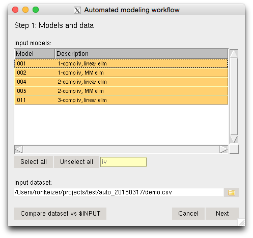
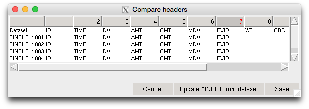
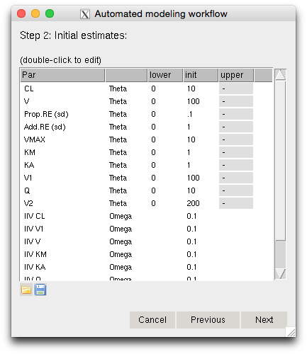
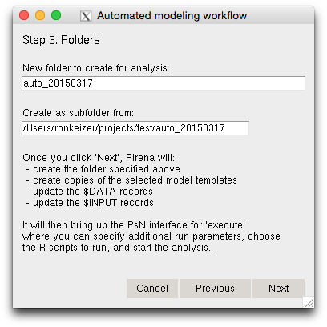
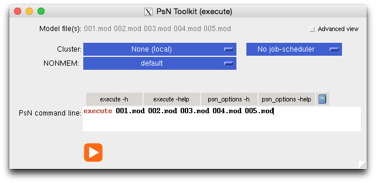
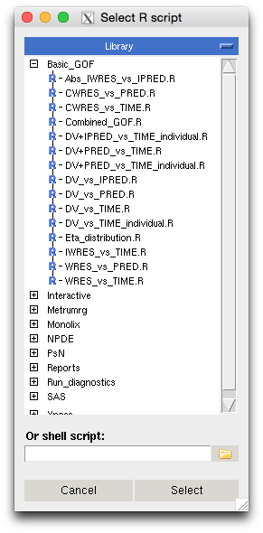
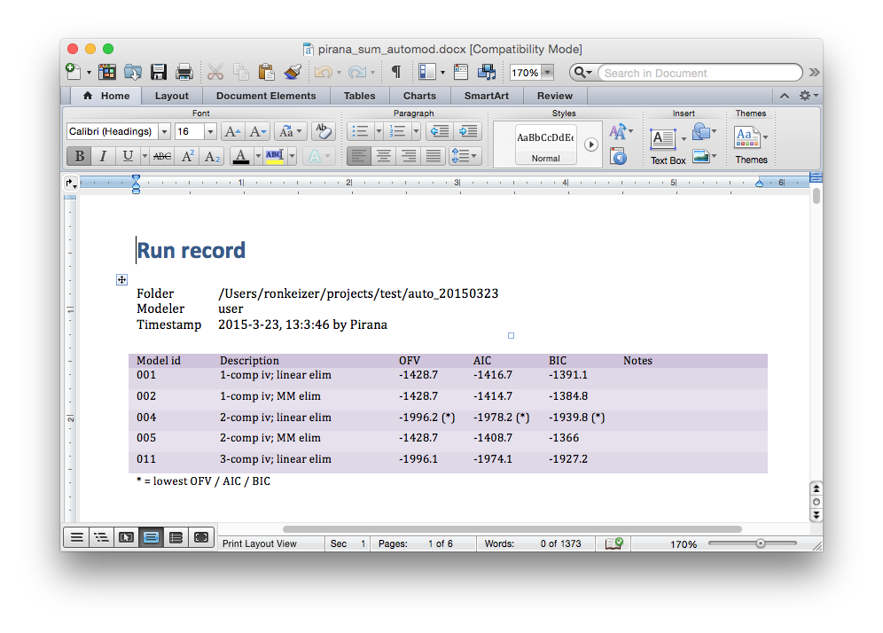

# Automated modeling workflow in Pirana

*Ron Keizer*
 
*March 2015*


## Background

An automated workflow alleviates the burden on modeling scientist by
removing the repetitive task of running and evaluating many candidate
models, standardizes the model development between modelers, and
standardize the results reported from such an analysis ultimately
leading to higher quality of PopPK analyses (*Schmidt et al. JPKPD 2014
Aug*). In Pirana (version >= 2.10), such a workflow is made available,
and in this tutorial we will walk through an example of an automated
population PK analysis. 


## Tutorial

For this tutorial, we will use the template model library that is provided with Pirana, and a (simulated) dataset of an
iv-administered drug also provided with Pirana (`demo.csv`).

### Start

Start Pirana Create a new project folder somewhere on your hard-drive
(or cluster). Browse into this folder (with Pirana). In this folder,
copy the file `demo.csv` that is included in the Pirana installation
folder (`Pirana/automod_library/demo/demo.csv`). In Pirana, go to
**Tools** --> **Automated modeling workflow**.

------

### Screen 1: Models and dataset



This screen shows all models available in the library and which can be
selected to be included in the analysis. Use the filter for
conveniently selecting e.g. only *iv* or only *oral* models. The
dataset should of course be specified as well before you can advance
to the next step. By default, it will use the first `.csv` file in
this folder (in alphabetic order).

When models and dataset have been selected, you should check whether the
`$INPUT` record in the models matches with the headers in the
dataset. For this, click the button `Compare dataset vs `$INPUT`. This
will bring up screen shown in figure 2:



If the `$INPUT` in the models (shown in rows 2-...) does not match up
with the dataset (shown in row 1), you can click the button `Update
$INPUT from dataset`. This will create a new $INPUT record for all
models. After clicking **Save**, when the models will be written (in
step 3 of the automated analysis), the $INPUT records in all models
will be changed to the new one. It is left to the user to make sure
that the variables used in the model are still included in $INPUT, as
there is no extra check in place for that.

For our current analysis, we will select all *iv* models, so filter on
*iv*, and select the remaining models. Update the `$INPUT` records,
click *Save* and then *Next* to advance to the next step.

------

### Screen 2: Setting initial parameter estimates

In the second screen, we can set initial parameter estimates, as well
as lower and upper bounds. All parameters are read from the models
that were selected in step 1. The parameter descriptions are defined
in the models as comments to `$THETA`, `$OMEGA`, and `$SIGMA` blocks,
like e.g.



```
$THETA
(0, 5, 100); CL
(0, 5, 100); V

$OMEGA
(0.1); CL
(0.1); V

$SIGMA
0.05 ; proportional error
```

*Note:* At current, correlations in $OMEGA and $SIGMA cannot be
 specified for an automated analysis. I.e. only the diagonal elements
 of $OMEGA and $SIGMA can be specified in the template models if you
 want to update them in this step. You can still include models that
 have full $OMEGA or $SIGMA blocks as template model, however you
 cannot provide descriptions (as comments) to the parameters in the
 block, and you cannot update them in this step of the analysis.

The two buttons below the parameter grid can be used to save and
(re-)load parameter definitions to file.

For our analysis, let's leave the parameters as they are. Click
**Next** to advance to the next step.

------

### Screen 3: Folders



In this screen we can specify where to create the new models and run
the analysis. By default it will generate a new folder name based on the
current date, and as a subfolder from the current folder in Pirana. This
screen also lists the actions that Pirana will perform once you click
*Next*.

Let's use the defaults and click *Next*.


### Screen 4: PsN dialog



Pirana should now have switched automatically to the new folder where
you will see the newly generated models. Pirana will also
automatically bring up the PsN `execute` dialog. In this dialog, if
you switch to **Advanced view**, you can select which R script(s) to
run after all runs have been completed to generate goodness-of-fit
plots. Click the *folder* icons next to the R scripts textboxes to
select R scripts (or batch files) to run after (or before) the
analysis (figure 6).



For our analysis, we will select the **Basic GOF plots as single doc**
from the `Reports` folder to create GOF plots for all models. The
graphical report will automatically be opened, but is also available
from the *Reports* tab on the right.

If you have not selected R scripts to be executed automatically after
the analysis has completed, you can still create them afterwards by
selecting the runs and running any R script from the **R** tab on the
right side of the Pirana window.

Besides the graphical report, Pirana can generate a *numeric* report for
the analysis, including e.g. OFVs, basic run information and parameter
estimates. This document is not generated automatically but has to be
requested manually after the analysis is complete: Make sure Pirana is
still in the folder where the analysis was run, and then go to **Tools** -->
**Automated modeling workflow** --> **Report**. On the first page you
will see an overview of all models included in the analysis and their
respective OFV, AIC and BIC (figure 7). The subsequent pages includes information
on each individual run in the analysis.


